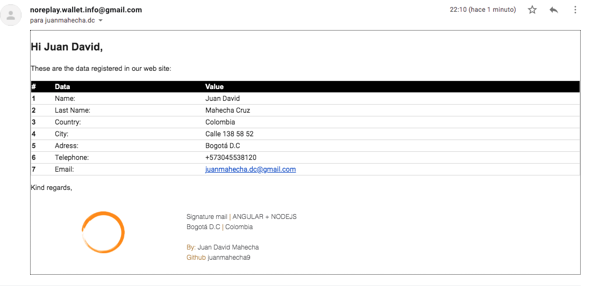

# Test angular-nodejs

El proyecto contiene el codigo fuente de un backend desarrollado en nodejs, el cual se ejecuta con el comando npm run start-dev el cual ejecuta el ambiente de prueba con babel y para poder ejecutar el proyecto compilado se ejecuta el comando npm start

## Estructura del proyeco:

El proyecto esta dividido en dos carpetas las cuales son:

1. api-hbs, la cual contiene el codigo final del proyecto integrando el frontend en el backend con lo cual se puede establecer un solo servicio para ejeccutar dicha app, este servicio por defecto se encuentra en el localhost:4000, ó en el localhost:4200 si se ejecutan en conjunto a angular.
   La interfaz de funcionamiento costa de un:

- una pagina de inicio
- una pagina de formulario la cual perimite le validar cuando los campos estan vacios o se encuentran con un erro (caso que se ve el con el correo).
- una pagina de inicio y de registro
- un perfil que muetra los datos del usuario
- una pagina que permite retirar o agrerar al balance del saldo, con la limitacion de que si el monto a retirar excede al actual no lo permite.

## Estructura del backend

El backend contiene el codigo en nodejs escrito con ecmascript 6, el cual usa como compilador a babel, la base de datos esta alojada en mongo db

# Imagenes de la interfaz

### Home

### Form

### Form Autocomplete select country, con este se procede a seleccionar el indicativo del pais

### Campos requeridos

### Form preview

### Envio de datos por correo

### inicio sesion

### inicio sesion error

### login

### profile

### remover saldo

### Agregar salgo

